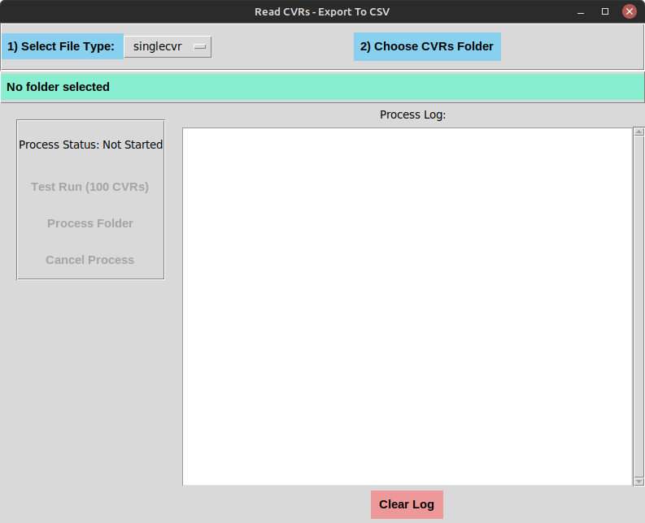

# TkCVRApp

## TkCVRApp wraps the ReadCVRStats dotnet program in a python TKinter GUI

* Choose a Folder with CVR files

* Start Process to generates the CSV results files in the parent directory of the chosen folder

* The process output is shown in the log area.

## Releases include the ReadCVRStats binary in the bin folder

The binaries are not source controlled but taken from release binaries in the read-xml-cvr-stats-export repository.

## Install Python for Windows
The python installer for Windows is found below at the python website.

[Python Installs for Windows](https://www.python.org/downloads/windows/)

## Install Python for Mac OS
The python installer for Mac OS is found below at the python website.

[Python Installs for Mac](https://www.python.org/downloads/macos/)

### Install Python3 on Linux Mint for example:

Rough python3 dependencies install steps

`sudo apt install python3`

`sudo apt install python3-pip`

`pip install python3-tk`

To make usr/bin/python find python3 I used

`sudo apt install python-is-python3`

## Use

Double click on the python script to launch it.
